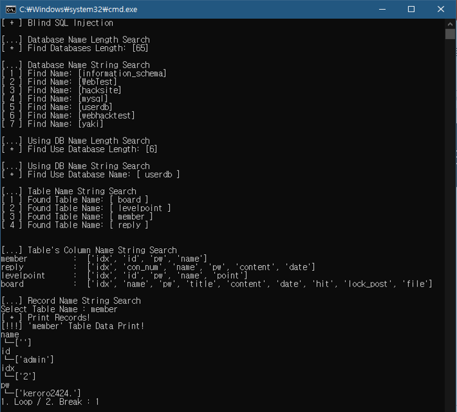
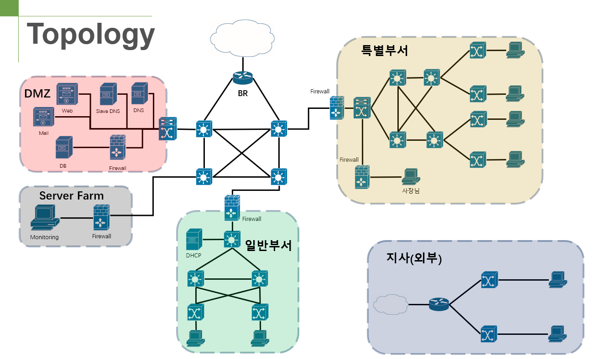
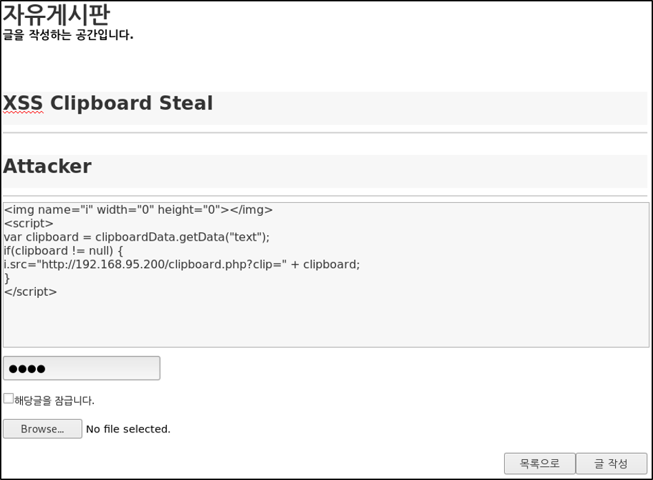

### Penetration Test Security Network

- 사내 네트워크의 안전과 웹 서버의 보안이 적절한가를 테스트 하기 위한 모의 해킹 망 구축 및 운영
- 모의 해킹 수행
  - Scanning
  - Network Hacking
  - Web Hacking
  - Metasploit Vulnerability Exploit
- 보안 장비 운영
  - IDS(Instruction Detection System), IPS(Intrusion Prevention System)
  - Anti - DDoS
  - WAF(Web Application Firewall)
  - NAC(Network Access Control)
  - ESM(Enterprise Security Management)
  - Server & Network Monitoring

***
### Building a Secure Network Infrastructure

- VLAN을 이용하여 내부 네트워크 분할
- 이중화
  - VRRP : 게이트웨이 이중화 프로토콜 사용
    - Master-backup 방식 사용
  - PVST : 각 VLAN 별로 루트 스위치를 따로 지정
    - VLAN 스패닝트리가 동작하기 때문에 부하분산 효과로 인한 VLAN별 최적의 경로 유지
  - 스패닝 트리(Spanning-Tree) : 스패닝 트리 프로토콜(STP) 이용
    - Switch를 이중화 하기 위한 프로토콜
    - 최적의 경로만 활성화 시키고 장애 발생 시 백업 경로를 활성화
- 보안망
  - UTM(Unified Threat Management) : 통합 위협 관리 시스템
    - 스테이트풀 인트팩션 방화벽과 침입 방지 및 안티바이러스 솔루션의 기능을 결합시킨 장비로 운영
  - VPN(Virtual Private Network)
    - Site - to - Site VPN 사용
    - 사용되는 프로토콜은 IPsec(Internet Protocol Security)

***
### Web Hacking Web Tutorial Site

- 웹 해킹을 연습할 수 있는 튜토리얼 홈페이지 구현
- SQL Injection, XSS, CSRF, ByPass 등의 해킹 기법을 테스트 할 수 있음
- 위 공격에 따른 보안 적용

***
### Graduation Project (LEGO)

- Blockchain을 이용한 회계장부
- 서비스는 웹으로 제공되며, 핸드폰으로도 확인 가능하도록 사용자 UI를 제공
- O-Auth를 이용하여 회원가입 및 사용자 식별에 대한 편의성 제공
- Hyperledger Fabric의 Private기반의 Blockchain을 이용하여 데이터는 일반적으로 공개되지 않은 서버에서 작성
- 특정 그룹에 속한 회원들만 해당 그룹의 장부를 확인할 수 있음
- 사용자들은 자신에게 지급된 Hash 값을 이용하여 실제 데이터가 올바르게 작성 되었는가를 확인할 수 있음

  
***
### BigData Project

- 업무의 마감에 대한 스트래스 해소에 관련된 Dataset을 사용
- 일반적인 사무 업무를 할당하여 25명의 피험자에 대하여 데이터를 수집
- 컴퓨터 로깅, 표정, 자세, ECG(심전도) 신호 및 피부 전도도 등의 데이터를 수집
- 업무를 하며 스트레스를 확인하여 no stress일 경우는 헬스 코치가 필요하지 않지만 그 외의 경우에는 사용자의 스트레스 수치가 증가하게 됨
- 스트레스가 증가하여 헬스 코치가 필요하다는 것을 예측하기 위한 Machine Learning 수행

***
### World Cloud Project

- Python Flask Web Server기반의 데이터 송/수신
- 텍스트 파일을 업로드 후 해당 파일 내에 존재하는 문자열의 빈도만큼 이미지의 크기로 출력
- Fornt-end 부분은 React 기반의 UI로 구현
- PC 웹 브라우저 화면과 모바일 웹 브라우저 화면에서 호환되도록 디자인 구성

***
### .NET Project

- 사내 사원들의 인트라넷 회원가입을 관리하는 솔루션
- 특정 사원이 자신의 사번을 이용하여 인트라넷에 회원 가입을 요청하면 인사팀에서 옳바른 사원인지를 확인하여 등록 해 주는 시스템
- MVVM(Model - View - View Model) 구현 방식 사용
