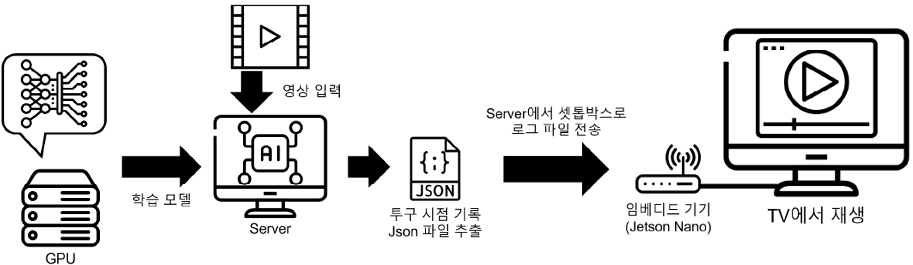
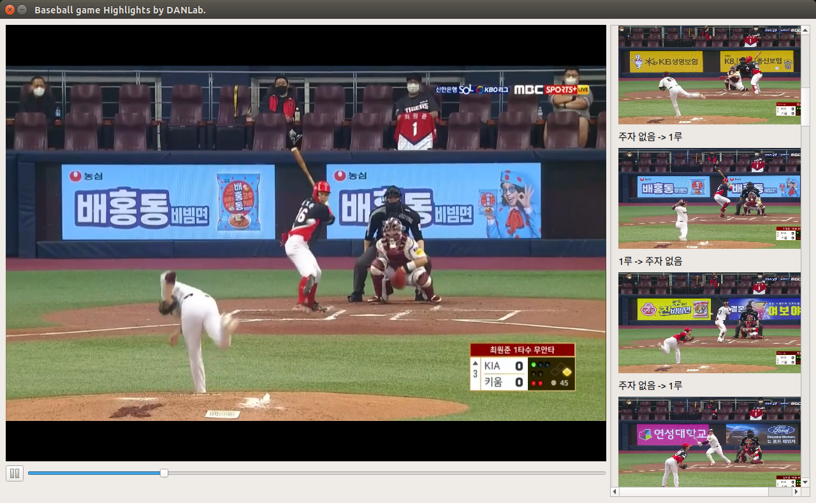
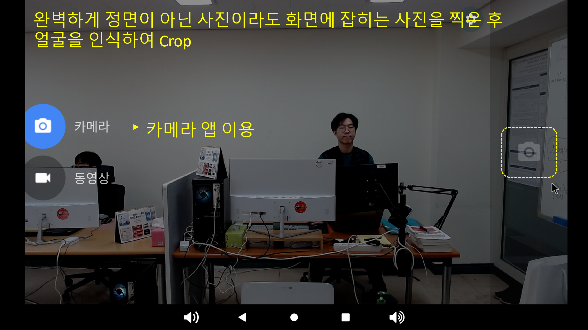
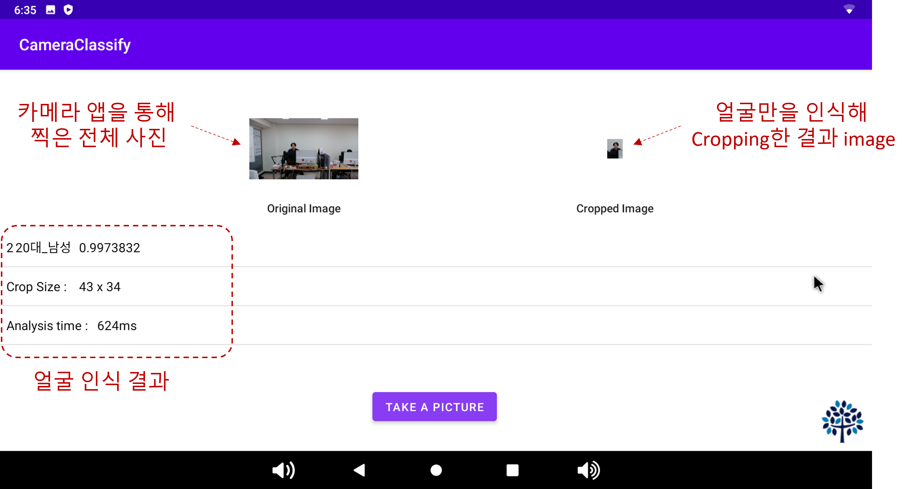

## 딥러닝 알고리즘을 이용한 특정 동영상 컨텐츠 내 포즈 및 인식 시점 알고리즘 개발

- 프로젝트 명 : 동영상 하이라이트 시점 태깅
    - 기간 : 2021.01 ~ 2021.05
- 기술
    - 언어 : Python 3.8
    - Deep learning
        - Object detection
        - Pose recognition
        - Scene classification
    - Machine learning
        - Classification
- Framework
    - Tensorflow 2.4
    - PyTorch 1.8
    - Yolov5
- 프로젝트 내용
    - 야구 동영상을 이용한 하이라이트 시점 태깅 알고리즘 제안
    - 투수의 투구 시점을 기준으로 다음 투구 시점을 탐색
    - 해당 투구 시점 내에 점수의 변화가 있는 경우를 로그로 기록
    - GUI 화면으로 서비스 제공

  
   
  &lt;시스템 구성&gt;

   
  
   
  &lt;분석 결과 출력&gt;

***

## 딥러닝 알고리즘 기반의 임베디드 HW용 얼굴인식 기술 모델
  
- 프로젝트 명 : 사용자 연령 및 성별 예측 맞춤 서비스
    - 기간 : 2020.08 ~ 2020.10
- 기술
    - 언어 : Python 3.8
    - Deep learning
        - Deep Neural Network
        - Convolutional Neural Network
        - One-hot encoding
    - Machin learning
        - Classification
- Framework
    - Tensorflow 2.x
    - Keras
    - OpenCV
- 프로젝트 내용
    - 얼굴 인식 기반의 사용자 별 서비스 제공
    - 사용자의 얼굴을 인식하여 연령과 성별을 예측하고 그에 맞는 서비스를 제공
    - 10대 남,여 ~ 60대 남,여로 총 12개의 분류 클래스를 사용

  
   
  &lt;사용자 촬영&gt;

   
  
   
  &lt;분석 결과 출력&gt;

